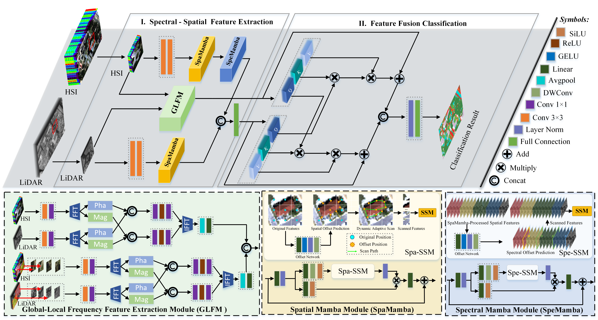

# Spectral-Spatial-Dynamic-Scan-Mamba

###   🌱Abstract
> Multi-source remote sensing data classification refers to the process of categorizing ground objects by integrating complementary strengths of multiple remote sensing data, such as hyperspectral images, light detection and ranging and synthetic aperture radar data. However, current Mamba-based multisource remote sensing data classification approaches rely on fixed scanning patterns that are inadequate in characterizing spectral-spatial information. Additionally, most current fusion techniques adopt concatenation or attention-based fusion rules without considering the complementary characteristics between different modalities. To address these limitations, we propose a spectral-spatial dynamic scan Mamba (SDSM) for multi-source remote sensing data classification. First, a multi-source dynamic scan Mamba network is proposed to extract the spectral-spatial features, in which a dynamic scan module is designed to capture the important spatial and spectral information. Then, a global-local frequency feature extraction module is designed to extract the salient structural features of multi-source remote sensing data. Finally, a bidirectional cross-modal fusion rule is designed to merge the extracted features followed by a fully connected layer to yield the final classification map, in which the salient structural features are utilized as cues to enhance the fusion performance. Comprehensive experiments on four multisource remote sensing datasets, i.e., MUUFL, Augsburg, Italy and Yellow River, demonstrate that the proposed method outperforms other state-of-the-art methods with respect to quantitative and qualitative results.

### 🧩Overall



### 📋 Requirements
> - CUDA 12.1
> - Python 3.9.19
> - PyTorch 2.0.1
> - Torchvision 0.15.2
> - causal_conv1d==1.4.0
> - mamba_ssm==2.2.2

### 🚀 Usage

### Dataset Preparation

Organize your dataset as follows:
```
dataset/
  └── Augsburg/
      ├── TrainImage.mat  # Training set
      └── TestImage.mat  # Test set
```

### Training
```bash
python main.py --model SDSM \
               --flip_augmentation \
               --patch_size 7 \
               --epoch 400 \
               --lr 0.0001 \
               --batch_size 64 \
               --seed 0 \
               --dataset Augsburg \
               --folder './dataset/' \
               --train_set './dataset/Augsburg/TrainImage.mat' \
               --test_set './dataset/Augsburg/TestImage.mat' \
               --cuda 0
```

### Key Parameters

- `--model`: Model architecture (default: SDSM)
- `--epoch`: Number of training epochs
- `--lr`: Learning rate
- `--batch_size`: Batch size for training
- `--dataset`: Dataset name (Augsburg, Italy, MUUFL, etc.)
- `--cuda`: GPU device ID

## 💌 Acknowledgments

This project is largely based on [Mamba](https://github.com/state-spaces/mamba),[VMamba](https://github.com/MzeroMiko/VMamba) and [DAMamba](https://github.com/ltzovo/DAMamba). We are truly grateful for their excellent work.
